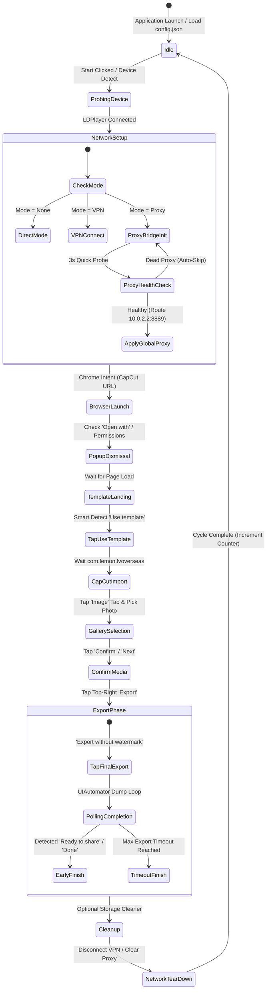

# 🧠 CapCut Automation Bot — Complete System Brain & Architecture

Welcome to the internal engineering blueprint and architectural "Brain" of the **CapCut LDPlayer Automation Bot**. This document serves as the master technical specification for engineers, maintainers, and future AI development agents.

---

## 🏛️ System Philosophy & Core Design Principles

### 1. Why Native ADB over Appium or Selenium?
* **Zero APK Footprint**: Does not require installing accessibility services, test harnesses, or helper APKs on the emulator.
* **Ultra-Low Latency**: Direct TCP socket communication with LDPlayer's ADB daemon (`adbd`) on `127.0.0.1:5555` or `emulator-5554` delivers sub-10ms command execution.
* **Immunity to App Updates**: Native UI inspection via `uiautomator dump` combined with calibrated coordinate fallbacks ensures the bot continues operating even if CapCut changes button styles or DOM trees.

### 2. Resolution Calibration Standard
All spatial coordinates in this bot are strictly calibrated for:
* **Display Mode**: Android Tablet Mode
* **Resolution**: **720 × 1280** pixels
* **Screen Density (DPI)**: 320 DPI
* **Host OS**: Windows 10 / 11

---

## 🔄 Complete Lifecycle State Machine



---

## 🌐 The Zero-Config Python Proxy Bridge

### The Problem It Solves
Android's native global proxy setting:
```bash
adb shell settings put global http_proxy <host>:<port>
```
only supports plain unauthenticated HTTP proxies. It **fails completely** when given:
1. `SOCKS5` or `SOCKS4` protocols.
2. Authenticated proxies requiring `username:password`.

### The Solution Architecture
The bot runs an asynchronous Python proxy bridge (`ProxyBridge`) bound to `0.0.0.0:8889` on the Windows host machine:

```text
[LDPlayer Android Emulator]
         │
         │  HTTP / HTTPS CONNECT (via default gateway: 10.0.2.2:8889)
         ▼
[Python ProxyBridge : 8889]
         │
         ├─► If Upstream is SOCKS5:
         │   1. Sends RFC 1928 Handshake (\x05\x01\x00)
         │   2. Sends RFC 1929 User/Pass Auth (\x01 + user + pass)
         │   3. Sends SOCKS5 Connect Command (ATYP=3 domain name)
         │   4. Spawns bidirectional socket pipe (client <--> socks5)
         │
         └─► If Upstream is HTTP / HTTPS:
             1. Sends HTTP CONNECT host:port HTTP/1.1
             2. Injects Proxy-Authorization: Basic <base64>
             3. Awaits "HTTP/1.1 200 Connection Established"
             4. Spawns bidirectional socket pipe (client <--> http)
```

### Dedicated Test Bridge (Port 8890)
To test proxies in real-time without disturbing an ongoing automation session, the **"⚡ Test Proxy"** button spins up an ephemeral bridge on `127.0.0.1:8890`, issues a lightweight probe request to `http://api.ipify.org?format=json`, measures response latency (Ping in ms), and destroys the bridge immediately.

---

## 🎯 Screen Coordinates & Smart UI Detection

### Calibrated Screen Matrix (720 × 1280)

| Action Target | Default Coordinates | Fallback Keywords | Purpose |
|---|---|---|---|
| **Browser 'Use template'** | `(365, 1274)` | `"Use template"`, `"CapCut"` | Triggers CapCut app deep-link from Chrome |
| **CapCut 'Use template'** | `(270, 1214)` | `"Use template"` | Confirms template usage in CapCut UI |
| **Gallery Photos Tab** | `(588, 150)` | `—` | Switches from Videos to Photos |
| **First Photo in Grid** | `(150, 345)` | `—` | Selects the first imported image |
| **Gallery Confirm** | `(620, 1180)` | `"Next"`, `"Confirm"`, `"Add"` | Proceeds to video editor timeline |
| **Top-Right Export** | `(625, 60)` | `"Export"` | Opens export modal |
| **Final Export Button** | `(360, 1210)` | `"Export without watermark"`, `"Export"` | Starts video rendering |
| **Windscribe Connect** | `(241, 734)` | `—` | Taps main circular connect button |
| **Windscribe Disconnect**| `(600, 220)` | `—` | Taps disconnect button |

### Smart UI Centroid Calculation
When `tap_with_smart_detect` executes:
1. Dumps XML hierarchy: `adb shell uiautomator dump /data/local/tmp/uidump.xml`
2. Reads XML contents and searches for target keyword in `text` or `content-desc`.
3. Extracts bounding box coordinates: `bounds="[x1, y1][x2, y2]"`
4. Computes geometric center:
   $$\text{target\_x} = \frac{x_1 + x_2}{2}, \quad \text{target\_y} = \frac{y_1 + y_2}{2}$$
5. If found, taps the exact center; otherwise, safely falls back to calibrated default coordinates.

---

## 🛡️ Anti-Detection & Humanization Engine

1. **Randomized Pixel Jitter**:
   Every tap applies a random normal micro-offset:
   $$\text{actual\_x} = x + \text{random.randint}(-4, 4)$$
   $$\text{actual\_y} = y + \text{random.randint}(-4, 4)$$
   This prevents pattern matching algorithms on CapCut/TikTok from detecting automated bot taps.

2. **Jittered Action Delays**:
   All wait timers between browser loading, image confirmation, and template rendering use continuous uniform distributions (`random.uniform(min, max)`), avoiding mechanical fixed-interval signatures.

---

## 🚀 Smart Early Render Detection

Traditional bots waste significant time by sleeping for a fixed 30–45 seconds during video rendering.

### The Algorithm:
1. Wait 5 seconds for initial rendering to start.
2. Every 2 seconds thereafter, inspect the active screen hierarchy via UIAutomator.
3. Check for completion marker tokens:
   `["Ready to share", "Share to TikTok", "Share", "Done", "Save to your device"]`
4. When detected:
   * Record `elapsed` time.
   * Log saved seconds: $\Delta t = \text{max\_wait} - \text{elapsed}$
   * Immediately exit export phase and begin next cycle.

---

## 📱 Storage Protection Engine

When mass-producing videos (e.g., 100–500 cycles), LDPlayer's virtual disk storage (`/sdcard/Movies/CapCut/`) quickly saturates, causing emulator crashes.

* When **"Auto-clean exported videos"** is checked:
  * Executes: `adb shell rm -f /sdcard/Movies/CapCut/*.mp4`
  * Executes: `adb shell rm -f /sdcard/DCIM/Camera/*.mp4`
  * Fires media scanner broadcast to refresh Android's media database.
  * **Result**: Source gallery images remain 100% intact; virtual disk never fills up.

---

## 🛠️ Developer & AI Maintenance Rules

1. **Preserve Threading Safety**: Always run ADB operations, proxy requests, and network health checks inside daemon worker threads. Never execute blocking socket or subprocess calls on Tkinter's main loop.
2. **Path Independence**: Always resolve tools and scripts relative to `SCRIPT_DIR = os.path.dirname(os.path.abspath(__file__))`. Binaries live in `tools/`, docs live in `docs/`, and backups live in `archive/`.
3. **Graceful Exit**: On window close (`WM_DELETE_WINDOW`), ensure `stop_event.set()` is called, the local `ProxyBridge` is stopped, and `clear_proxy_on_device()` cleans up Android's `http_proxy` setting.
